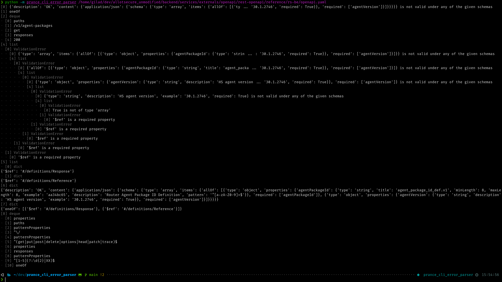
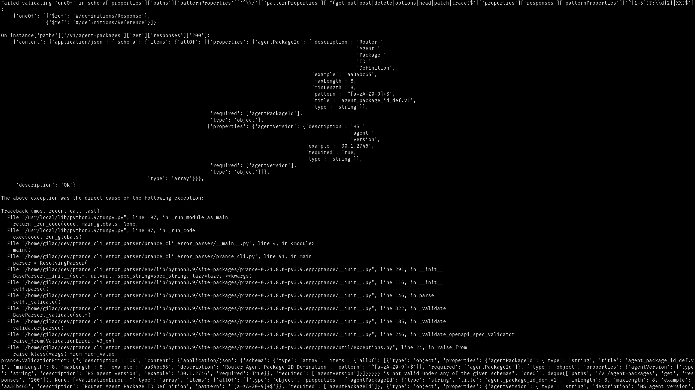

# Installation

Either with `poetry`, or with e.g virtualenv with `setup.py`

# Usage

```bash
python -m prance_cli_error_parser --help
```

## Example:

```bash
python -m prance_cli_error_parser /path/to/openapi.yaml
```

## `prance_cli_error_parser`'s output vs vanilla `prance` exception:

### prance_cli_error_parser:



### vanilla `prance` exception:



